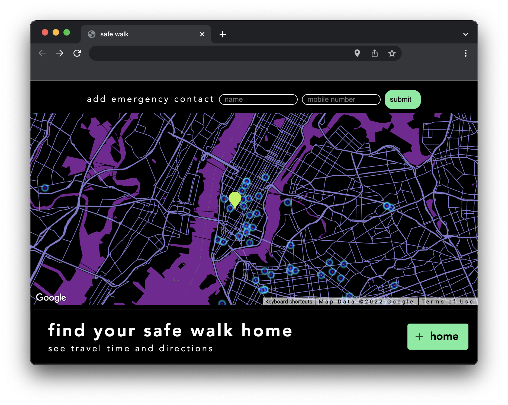
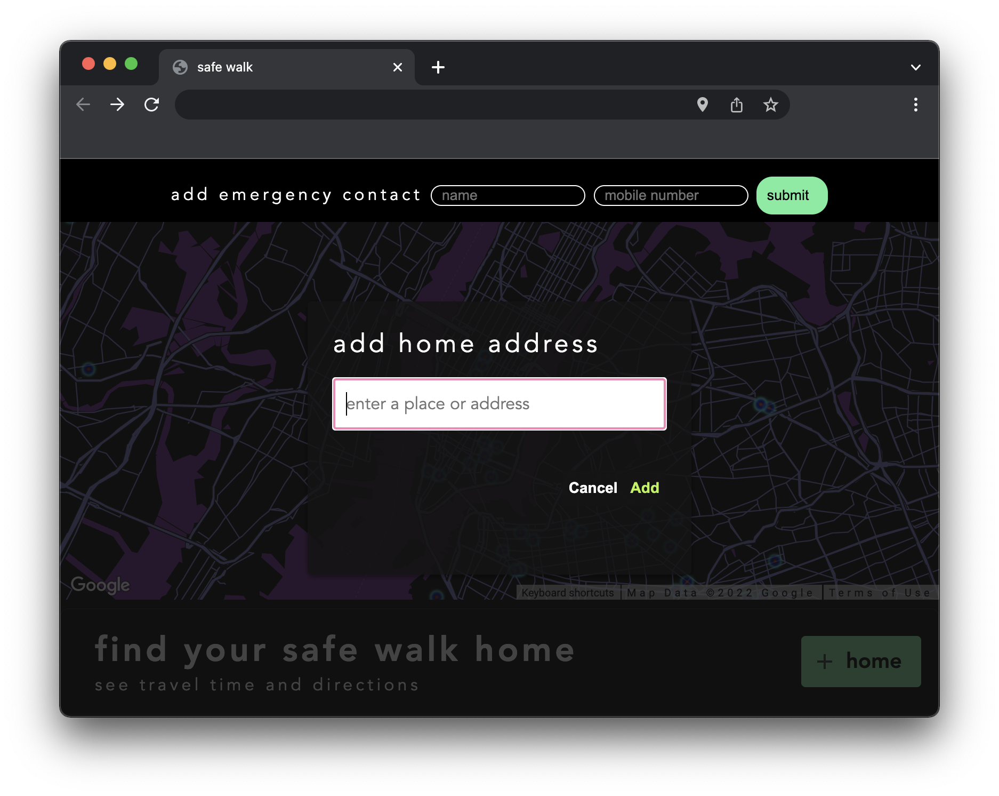
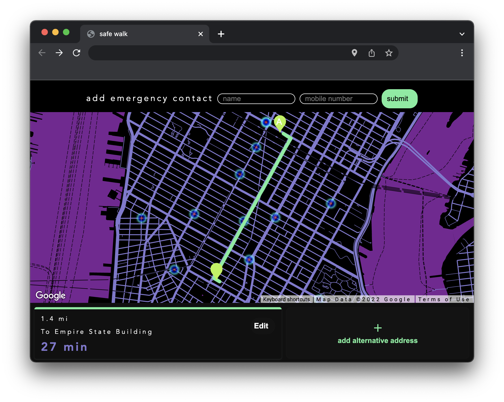

# Columbia University Coding Bootcamp - Safe Walk: Project 1: 

## Description

This project leverages the [Google Maps API](https://developers.google.com/maps) and the [CrimeoMeter API](https://www.crimeometer.com/) to display a heat map of recent assault and robbery locations within 10 miles of the users position. This visual element is bolstered with directions to a desired destination input by the user.




**Copied here is a link to the deployed application:**
(https://katebonner.github.io/safe-walk/)


## Table of Contents 

* [Installation](#installation)
* [Usage](#usage)
* [Credits](#credits)
* [License](#license)


## Installation

To install this project, navigate to your comand line console (for simplicity we will assume you are using terminal) and:

Create a directory in which this project can live.
```md
mkdir <directory-name>
```
Open the directory you just created.
```md
cd <directory-name>
```
Clone this repository.
```md
git clone git@github.com:katebonner/safe-walk.git
```
Open the directory you have just created in your code editor of choice either manually or via:
```md
code .
```

## Usage

This project maps a user's current location to a map, layered with a heat map that is populated with recent assault and robbery location data. The user can then input a destination to retrieve directions to it from their current position.



 Along their path home, they will be able to see when they are coming up on a location with a recent incident of assault or robbery.




## Credits

This site fetches map data from the [Google Maps API](https://developers.google.com/maps) and the crime location data from the [CrimeoMeter API](https://www.crimeometer.com/)

Additionally, the google maps API documentation offered some starter solutions with which this project was oriented. Their copyright licensing is as follows:
```md
  Copyright 2021 Google LLC

  Licensed under the Apache License, Version 2.0 (the "License");
  you may not use this file except in compliance with the License.
  You may obtain a copy of the License at

      https://www.apache.org/licenses/LICENSE-2.0

  Unless required by applicable law or agreed to in writing, software
  distributed under the License is distributed on an "AS IS" BASIS,
  WITHOUT WARRANTIES OR CONDITIONS OF ANY KIND, either express or implied.
  See the License for the specific language governing permissions and
  limitations under the License.
```

This site was built using [GitHub Pages](https://pages.github.com/).


## License

MIT License

Copyright (c) 2022 Kate Bonner

Permission is hereby granted, free of charge, to any person obtaining a copy
of this software and associated documentation files (the "Software"), to deal
in the Software without restriction, including without limitation the rights
to use, copy, modify, merge, publish, distribute, sublicense, and/or sell
copies of the Software, and to permit persons to whom the Software is
furnished to do so, subject to the following conditions:

The above copyright notice and this permission notice shall be included in all
copies or substantial portions of the Software.

THE SOFTWARE IS PROVIDED "AS IS", WITHOUT WARRANTY OF ANY KIND, EXPRESS OR
IMPLIED, INCLUDING BUT NOT LIMITED TO THE WARRANTIES OF MERCHANTABILITY,
FITNESS FOR A PARTICULAR PURPOSE AND NONINFRINGEMENT. IN NO EVENT SHALL THE
AUTHORS OR COPYRIGHT HOLDERS BE LIABLE FOR ANY CLAIM, DAMAGES OR OTHER
LIABILITY, WHETHER IN AN ACTION OF CONTRACT, TORT OR OTHERWISE, ARISING FROM,
OUT OF OR IN CONNECTION WITH THE SOFTWARE OR THE USE OR OTHER DEALINGS IN THE
SOFTWARE.


